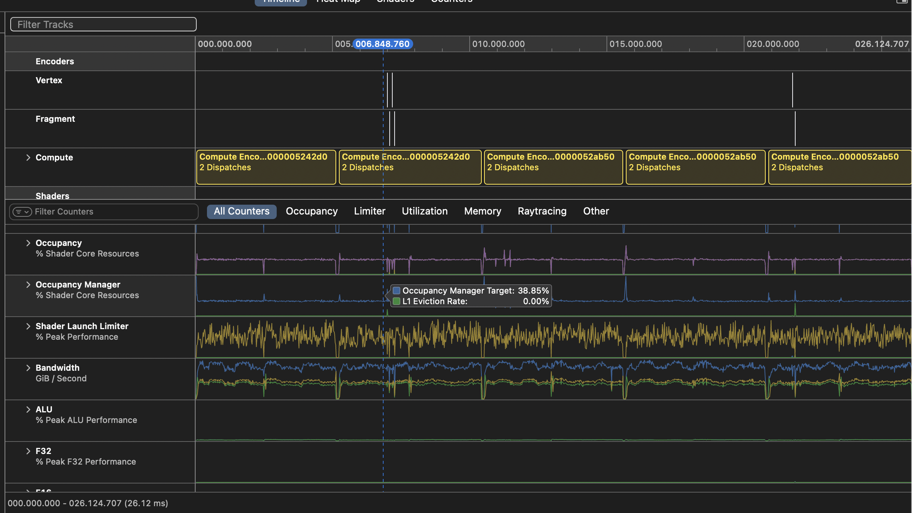

# Metal GPU Profiling



## GPU Frame Capture
```objc
MTLCaptureManager *captureManager = [MTLCaptureManager sharedCaptureManager];
MTLCaptureDescriptor *captureDescriptor = [[MTLCaptureDescriptor alloc] init];
captureDescriptor.captureObject = device;
captureDescriptor.destination = MTLCaptureDestinationDeveloperTools;
[captureManager startCaptureWithDescriptor:captureDescriptor error:&error];
// ... GPU work ...
[captureManager stopCapture];
```

### To allow `MTLCaptureManager` we must set 
```bash
MTL_CAPTURE_ENABLED=1
```


Example output from `test_matmul_with_profiling(false)`:
```
Performance Results:
(1000 x 3000) * (3000 x 1000) = (1000 x 1000):
CPU Time: 4432.869 ms
GPU Time: 32.426 ms
Speedup: 136.71x
✅ Matrix multiplication test PASSED!
```
